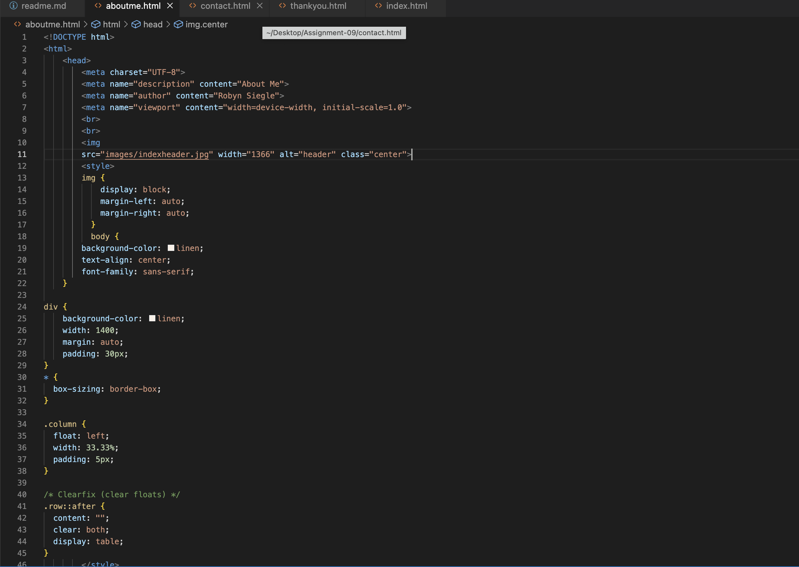

#Assignment Overview: Three Page Website 

##HTML Learning Experience

I found the HTML content relatively easy to follow along with. However, I also have used it before so a lot of it was merely a refresher. I think the content about 'rude coding' was new though. I hope I am able to continue to write my code in a manner that not only works, but is done correctly. Honestly, the biggest problem I ran into was with my code working for me, but not working correctly on github, and that was a file storage issue that I have since remedied.

I am not terribly nervous about CSS. I like CSS more than I like HTML if I remember correctly. My biggest concern is getting it to work to upload to Github. I did run into an issue with that previously.  I am actually really excited to start learning CSS. 

