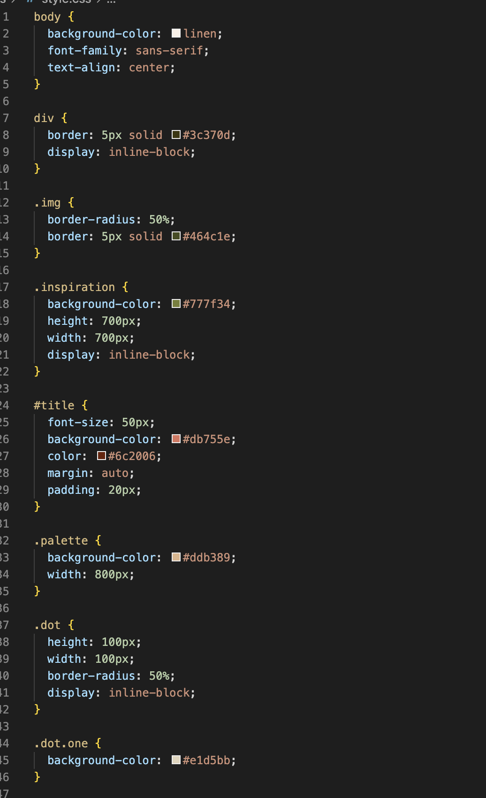

#Assignment Overview

Selectors and their differences:

Universal selectors are used to style every element on a page, or all elements. The element selector is a more narrow selector that is used to style all elements of a certain type. For example h1 or h2 elements. Class elements are even more narrow and are defined with . in front of their name in CSS. ID selectors are very similar to class selectors but instead of using a . they use a # to call up a unique identifier. 

My color palette was chosen using a Mucha painting. I picked hues that were complimentary and opposite to work off of one another.

Optional: I did struggle with this quite a bit more than I expected to. This is largely because I had spent so much time making my website look good without CSS that I was messing it up when I tried to go in. I need to take the time and really organize my thoughts on how I want to impliment a CSS sheet into it before I can actually do it. Instead of adding the CSS sheet to the entirety of my website, I followed along and made a single style sheet. That made it a little bit easier because I wasn't afraid of messing anything up.

