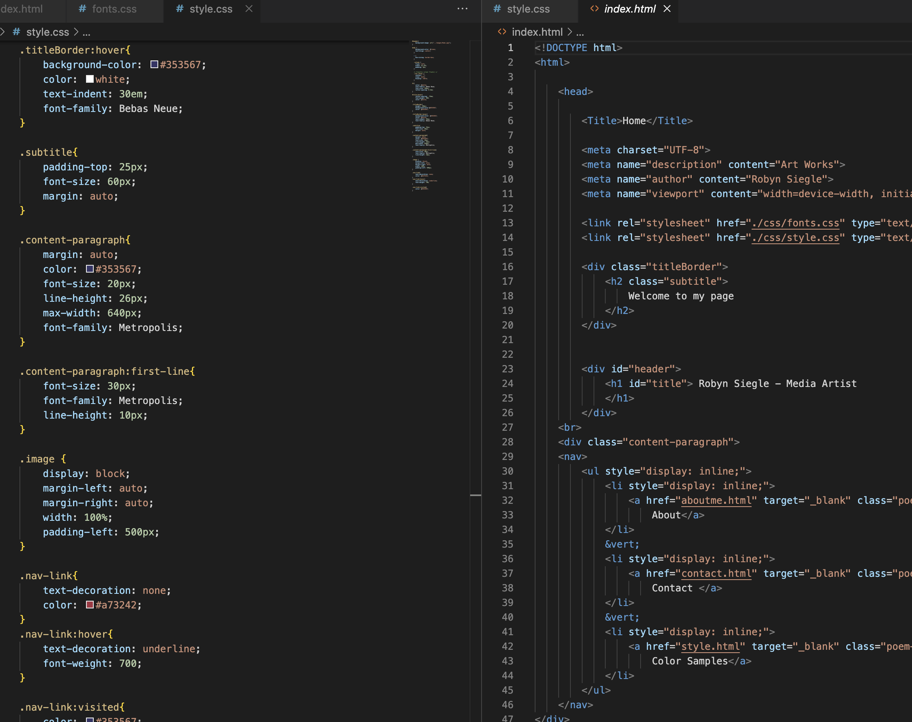

#Assignment Overview

What is typography?

Typography - Typography is the stye or appearance of arranging type. Specifically, within web design, typography is used to specify what information is being presented on the webpage.

What is the importance of having fallback fonts or a font stack?

To understand the importance of having fallback fonts, one must understand what a fallback font is. A fallback font is a backup or reserve typeface that contains Unicode characters. A fallback font is useful should a display system load font slowly or worse, encounter a character that is not available on the chosen fonts. When the fallback font is used, the display system then can pull the character from the fallback font. It also allow the designer to choose a font that better matches the intended font. 

What is the difference between a system font, web font, and web-safe font?

Web safe fonts are typefaces that are pre-installed or universal to most computers. A web font is a font hosted by a third party such as Google. A system font is a font pre installed on a computer. So the difference is that they all have varying levels of accessibility with web safe being the most universal between all display system and system font being the least universal.

