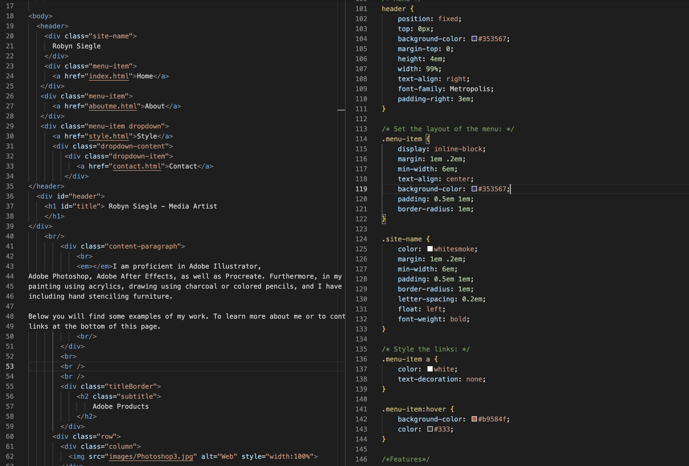

#Assignment Overview #12

What is the difference between padding, margin, and borders?

Borders are a defined outline, such as a box, that outlines an element. 

Padding is a  value which determines the amount of space between inner content and the element itself (or no element at all).

Margin is similar to padding however it is not only the space between inner content and a single element, but the space between those and *other* elements. 

So essentially, border outlines an element, padding defines the space between a border (for example) and an image element, and margin would define the space between two bordered images. 

Optional: how did this week's assignment go? What challenges did you face, and how did you overcome them?

I didn't run into any specific challenges this week. I did run a javascript dropdown for my style page for now just to help with navigation until I can rework that one. 

