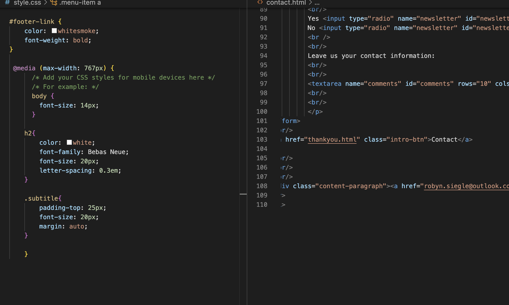

#Assignment Overview #13

Website Goals:

The goal of my website is to introduce the viewer to my work style and myself as a brand. A user might visit my site to look at my work prior to commissioning me for art or hiring me for design work. I tried to include a diverse range of styles because I have designed everything from T-Shirts to trophies used for Golf Tournaments to done logo work. 

Responsive web design is important for a variety of reasons from accessibility, speed, and navigation. However, perhaps one of the most important reasons to have a responsive website is for user engagement. The more engaged a user is, the greater the likelihood is that they will stay longer. I don't know the exact figures, but most websites have a very short time per visitor. The longer you can get someone to browse, the more likely you are to entice them to whatever the goal is. An added benefit is that it also increases the chance that a visitor will be back. I know websites that I've enjoyed visiting, I've looked at more than once.

I'm including a screenshot of my work for this week even though we weren't required to. I implemented some of the media call functions and fixed the direct for the submit on my contact page since the POST option doesn't work with github and the script I used to circumvent that wasn't working. It's not actually functional in that it gives me the information, but for the purpose of presentation it works. It also looks like the media call didn't take me a great amount of time, but it did because I was testing it on my phone after deploying it. I'm going to include a screenshot of that as well. 

