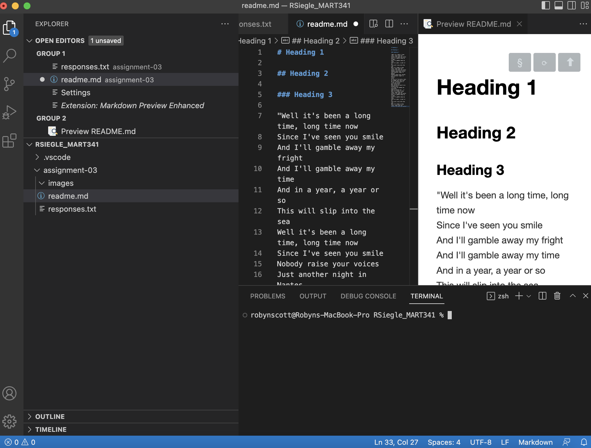

# Heading 1 

## Heading 2

### Heading 3

"Well it's been a long time, long time now
Since I've seen you smile
And I'll gamble away my fright
And I'll gamble away my time
And in a year, a year or so
This will slip into the sea
Well it's been a long time, long time now
Since I've seen you smile
Nobody raise your voices
Just another night in Nantes
Nobody raise your voices
Just another night in Nantes
Lisa!
Oh non je t'en prie, nous ne sommes pas chez nous
Oh je t'assure que ce n'est pas grave
Non laisse moi!
Mais qu'est-ce que tu as aujourd'hui?
J'ai que les hommes me dégoûtent
Vous ne pensez qu'à ça
Well it's been a long time, long time now
Since I've seen you smile
And I'll gamble away my fright
And I'll gamble away my time
And in a year, a year or so
This will slip into the sea
Well it's been a long time, long time now
Since I've seen you smile"

[National Gallery of Art](https://www.nga.gov)

[my file](.responses.txt)

