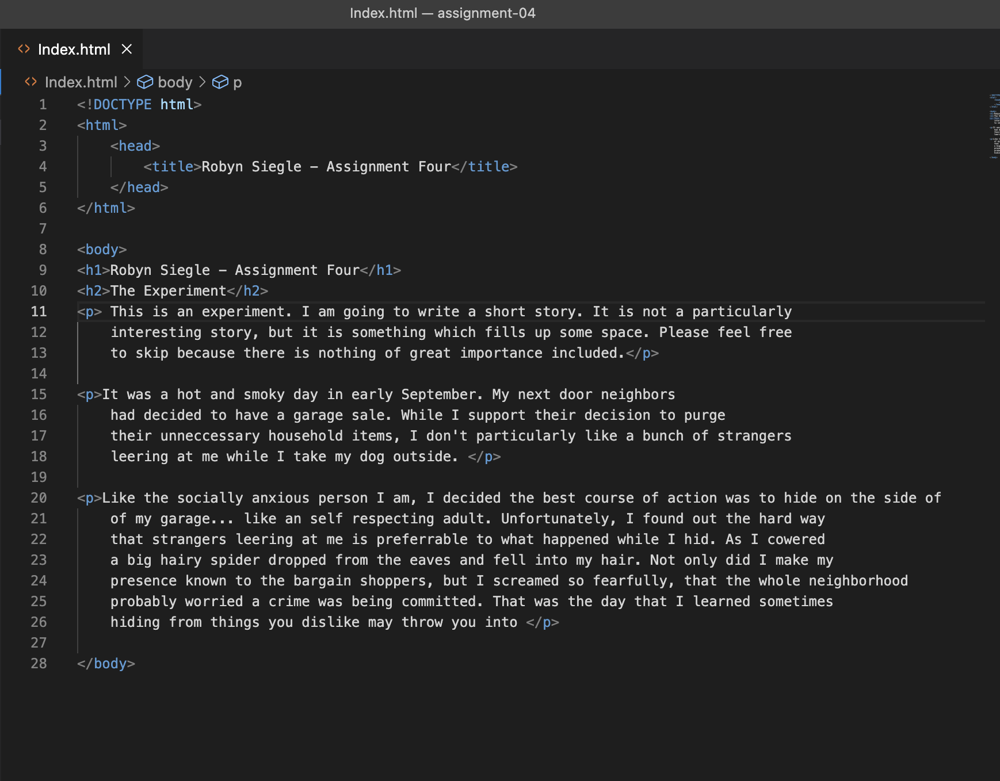

##Assignment 04
####Read ME

**How Browsers Function**

Web Browsers function by translating web languages like *HTML*, *CSS*, and *JavaScript* into viewable layouts that show text, graphics, etc without showing the web language.

I predominantly use Safari to browse the web. Occasionally, I will use Chrome but I prefer Safari.

