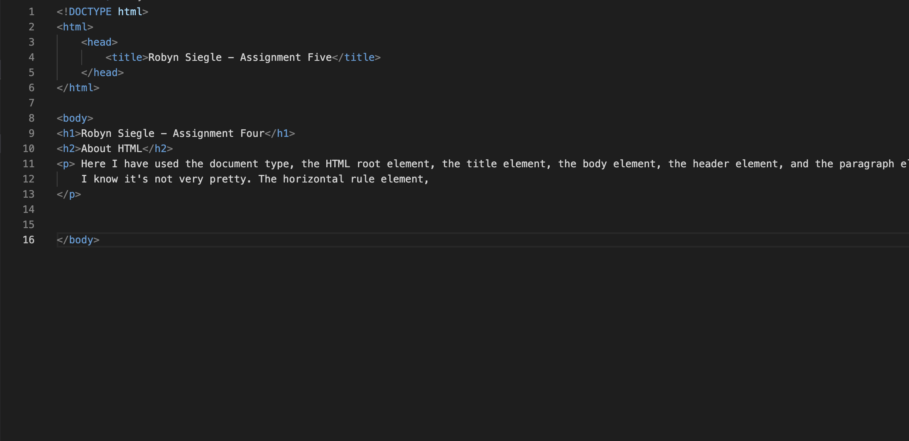

##Assignment 05

The site I visited using the wayback machine was Free People and the date was May 22, 2010. The older version uses completely different color schemes and instead of having the menu to access different pages across the top (2010 version), there is now a smaller icon that can be clicked and opens those up in a vertical sidebar.

 Otherwise, it looks similar, but the fashion has changed and some of the options on the old site are no longer available (specifically the catalogue options). It's really interesting to see because I used them for online shopping in 2010 and I still shop there occaisionally. It's funny how much it has changed, but how their choices have made the changes almost unnoticeable. 
 

