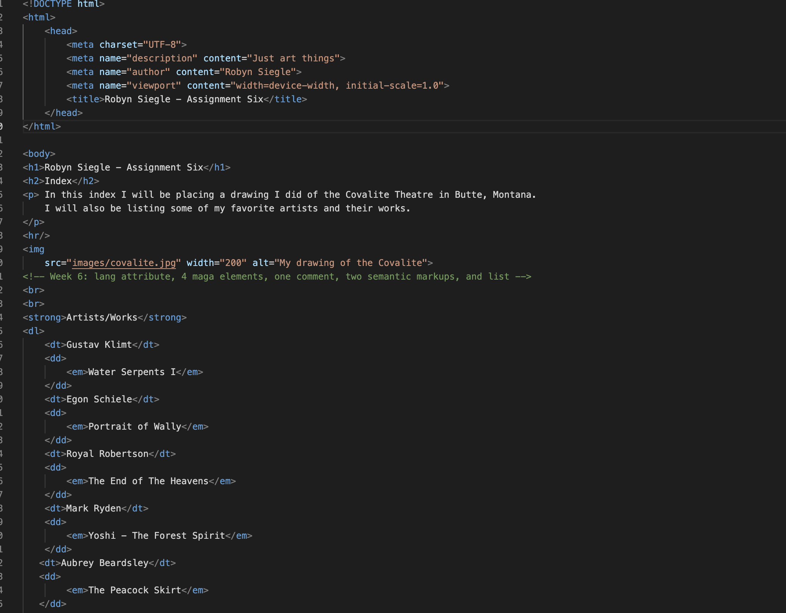

##Assignment 06

The differences between semantic and structural markup:

Structural markup is the information contained within code that gives information about how the document is structured. This includes headers,footers, paragraphs, etc. Semantic markup on the other hand is the information contained within code about the visual representation of how the document looks. Semantic markup includes commands like bolding, itallicizing, quoting, strikethroughs, citations, and more. 

 

