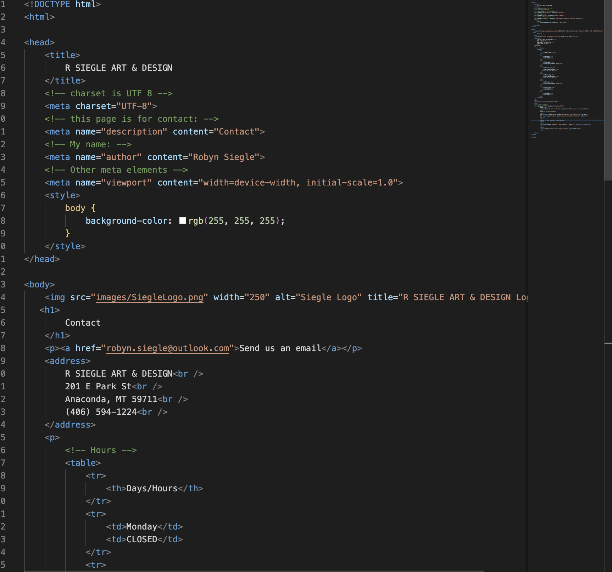
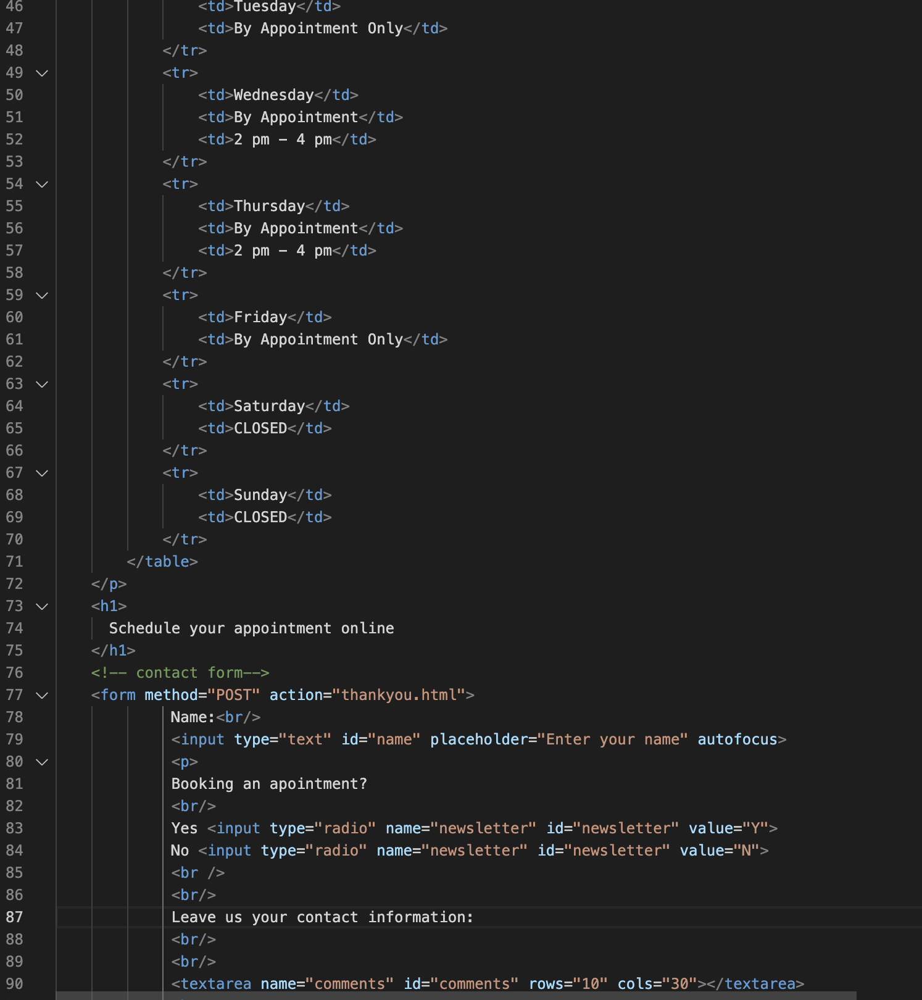

##Assignment 07

###Forms Encountered while browsing and their purposes

Some of the form types listed on the class website include: Drop Down Boxes, Text Entry, Radio Checkmarks, Buttons, Password Input,and File Uploads

I have encountered all of these while browsing the web. For drop down boxes, I have seen them used to select dates or items within a list. Text entry on the other hand works well for open ended answers that don't have a set list. Radio checkmarks are exceptional for making selections on a very limited list (one or two items). Buttons are great for answering or committing a single action. File uploads are for open ended answers where additional information is needed or for the sharing of information of various types of files. So to summarize, here is how I see these forms best used: 

**Drop downs** - a predetermined set of selections (usually 3 or more items)
**Text entry** - a field to input information where there is not a predetermined list
**Radio Checkmarks** - radio checkmarks allow for a user to select an option within a very limited list of predetermined answers (think yes or no)
**Buttons** - buttons are a single predetermined answer that routes a user to another area or commits an action.
**Password input** - this is one where there is no predetermined list but each individual user only has a single option (enter their password). This text input commits an action by loggin a user in or notifying them of a password error.
**File Uploads** - File uploads allow users to share information in multiple file types that may exceed what could be shared in a simple text entry form. 

 
 

