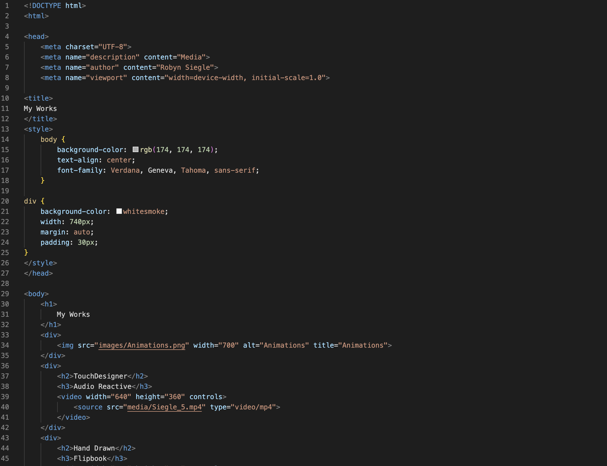

##Assignment 08

####What is Affordance?

Digital Affordances  are interactive actions with a finite set of possibilities. For example, a physical power switch or button, a slide screen on a phone, or a selection you make by clicking. Each of these affordances are interactive but have limited outcomes such as on, off, selecting a singular option, etc. 

####What are the advantages and disadvantages of using a third-party service like YouTube or Vimeo to host your videos?

There are advanges to both. Honestly, I think the iframe may be slightly easier to code, but I preferred the method of self hosting. I also appreciated the control over how the videos looked in my webpage.

 I liked that I could easily assign a "poster" image to each, whereas the youtube video, I could not figure out how to do that. These options that make self hosting work for me are disadvantages to Youtube or vimeo. 

The advantages of using third party hosts are that they use less bandwidth, have simple players, there isn't a requirement for multiple video sources, and they are more optimized.

####Optional: What challenges did you face this week with this assignment? How did you overcome them?

The only challenge I faced was that the youtube videos I wanted to use were all showing up as not available and redirecting to youtube. I overcame this by using a video my boyfriend made and posted over a decade ago. 

 

